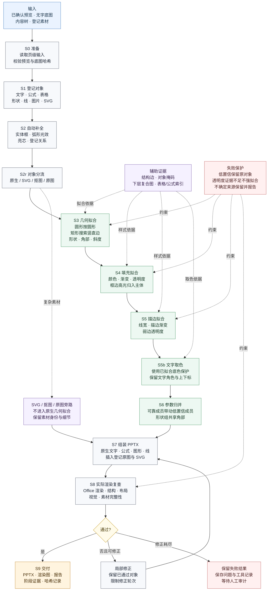

```mermaid
flowchart TD
    classDef input fill:#EAF3FF,stroke:#4B83C4,color:#17324D
    classDef stage fill:#F7F9FC,stroke:#6B7280,color:#202938
    classDef fit fill:#EDF8F2,stroke:#4D9A6A,color:#173B27
    classDef output fill:#FFF4DF,stroke:#C58A32,color:#4A2B00
    classDef decision fill:#FFFBEA,stroke:#C59A22,color:#4A3900
    classDef side fill:#F5F1FF,stroke:#8568B3,color:#35204F
    classDef protect fill:#FFF0F0,stroke:#C56B6B,color:#4F2020

    A[输入<br/>已确认预览 · 无字底图<br/>内容树 · 登记素材]:::input
    B[S0 准备<br/>读取页级输入<br/>校验预览与底图哈希]:::stage
    C[S1 登记对象<br/>文字 · 公式 · 表格<br/>形状 · 线 · 图片 · SVG]:::stage
    D[S2 自动补全<br/>实体框 · 弧形光效<br/>亮芯 · 登记关系]:::stage
    E[S2r 对象分流<br/>原生 / SVG / 抠图 / 原图]:::stage
    F[S3 几何拟合<br/>圆形按圆形<br/>矩形搜索竖直边<br/>形状 · 角部 · 斜度]:::fit
    G[S4 填充拟合<br/>颜色 · 渐变 · 透明度<br/>框边高光归入主体]:::fit
    H[S5 描边拟合<br/>线宽 · 描边渐变<br/>弱边透明度]:::fit
    I[S5b 文字取色<br/>使用已拟合底色保护<br/>保留文字角色与上下标]:::fit
    J[S6 参数归并<br/>可靠成员带动低置信成员<br/>形状组共享角部]:::fit
    K[S7 组装 PPTX<br/>原生文字 · 公式 · 图形 · 线<br/>插入登记原图与 SVG]:::stage
    L[S8 实际渲染复查<br/>Office 渲染 · 结构 · 布局<br/>视觉 · 素材完整性]:::stage
    M{通过?}:::decision
    N[S9 交付<br/>PPTX · 渲染图 · 报告<br/>阶段证据 · 哈希记录]:::output
    O[局部修正<br/>保留已通过对象<br/>限制修正轮次]:::stage
    P[保留失败结果<br/>保存问题与工具记录<br/>等待人工审计]:::protect

    A --> B --> C --> D --> E --> F --> G --> H --> I --> J --> K --> L --> M
    M -- 是 --> N
    M -- 否且可修正 --> O --> K
    M -- 修正耗尽 --> P

    Q[SVG / 抠图 / 原图旁路<br/>不进入原生几何拟合<br/>保留素材身份与细节]:::side
    R[辅助证据<br/>结构边 · 对象掩码<br/>下层复合图 · 表格/公式索引]:::side
    S[失败保护<br/>低置信保留原对象<br/>透明度证据不足不强拟合<br/>不确定来源保留并报告]:::protect

    E -. 复杂素材 .-> Q
    Q --> K
    R -. 拟合依据 .-> F
    R -. 样式依据 .-> G
    R -. 样式依据 .-> H
    R -. 取色依据 .-> I
    S -. 约束 .-> F
    S -. 约束 .-> G
    S -. 约束 .-> H
    S -. 约束 .-> L
```
